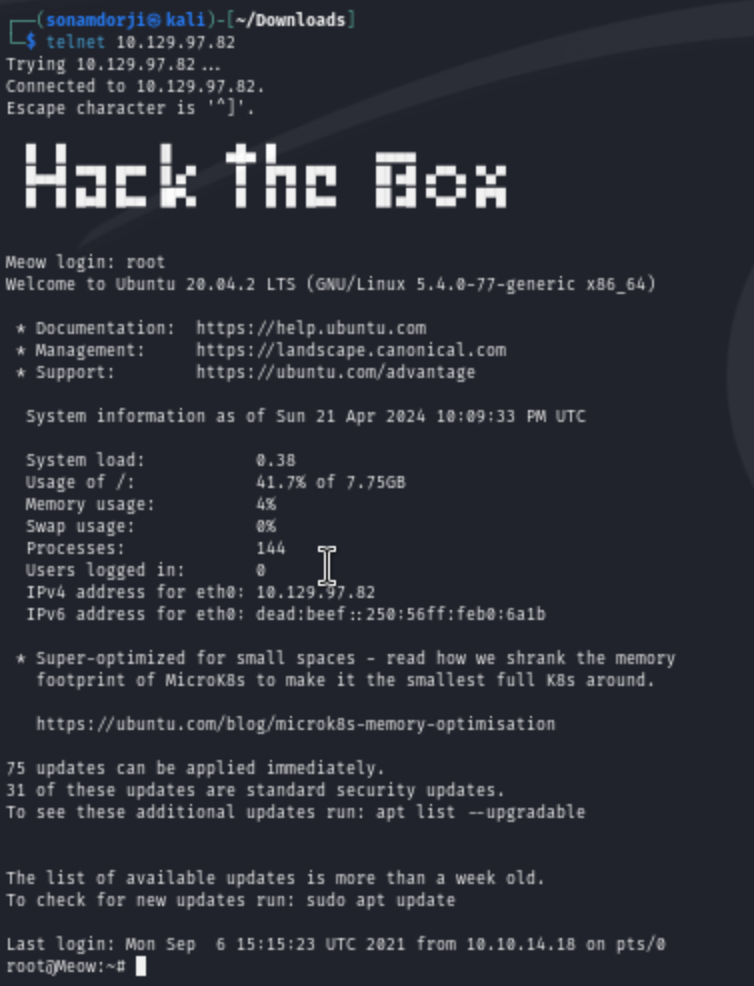

##  Topic: Hack the box 

Hello welcome to my blog, today we will be learing on Hack the box starting point tier 0. We will be learning on how to get gained access to the system and the new tools and protocols we learned along the way.

Hack The Box is an platform that allows us to practice our penetration testing and cybersecurity skills in a legal and safe environment. It offers a variety of virtual machines (VMs) that simulate real-world scenarios, each containing vulnerabilities for users to exploit.

---

### Connecting to the hack the hack the Box VPN

To accces the machine in hack the box, we need to connect to the hack the box VPN. where it involves downloadin of certain file and running the command  "openvpn file_name" in the terminal. It is an essential for us to connect to the VPN for tier 0 as all the task are done by starting the machine.

- OpenVPN: Provides a safe and private method to reach resources on a network or browse the internet, which is useful for both individuals and organizations.

If your successfully connecting to the hack the box VPN than you will see test in green like in this image below and if not than it will in red text.

After this,  we can active the machine my clicking the “Spawn Machine” button. After the machine has been spawned you will be provided with th IP address which is used to communicate with the machine.

- **Note**: We must be on the same network to gain access to all the machines. Therefore, we should always be connected to Hack the boxs VPN. 

---

### Tier 0 (Meow machine)

#### Gaining Access to the System

The main task in this machine is to submit the root flag. So, to get the root flag I need to get into the meow machine. Firstly, I need to find out how many ports are open and what all services are running on each port.

After starting up the machine, I received a IP address. This IP address will be used to complete all the tasks on the machine.

Inorder to check wheather I am i can talk to the machine or not I used the "ping" command. Ping command is used to test if the machine can accept requests.

To check and know which ports are open and which server are available on the port I used "nmap" command. nmap command scans the network giving the informations about machine.

**Result**: Port 23/TCP is open and its running on server telnet.

As the scan showed that the server is only listeninng to telenet on port 23, I tried connecting to telnet server inorder to access the machine.

To login into the machine, I used root as my user and it worked.

I have successfully logged into the machine and to answer the final question submit the root flag, I need to find the password which is hidden in some files. I found out that there is a flag.txt and snap file in the machine. I found the password while navigating into the flag.txt file.

## Command lines used

- ls: list all the files that are in the directory.
- cat:-display what’s inside the file.

## Learning Through the Meow Machine

In this machine I have learned how to access the machine which is running on server Telnet.

- Virtual machine: It run different operating systems or software on your main computer without affecting its setup. It is like a computer within a computer

- Terminal: Is a shell, a program that allows users to interact with their operating system through a command-line interface.

- Ping: It allows a user to test if a particular destination IP address exists and can accept requests.
Nmap: It is used to scan a network. It identifies active devices and open ports.

- Telnet: Enables us to connect to to a local computer.

---

